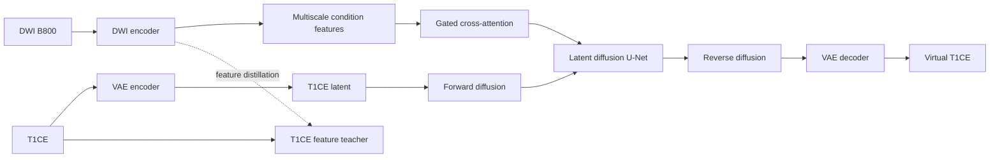

# Cross-Modal Breast MRI Synthesis

[English](./README.md) | [简体中文](./README.zh-CN.md)

> **Can DWI B800 be used to synthesize a spatially aligned T1CE image?**

Contrast-enhanced T1-weighted MRI (T1CE) improves the visibility of lesions and tissue boundaries, but it requires a contrast agent and an additional acquisition. Diffusion-weighted imaging at b=800 (DWI B800) measures diffusion-related tissue characteristics and is often acquired over the same anatomy.

This project studies DWI-conditioned T1CE synthesis with latent diffusion. The model first learns the distribution of T1CE images, then uses DWI as a conditioning signal to synthesize the corresponding T1CE image.

## Method

An end-to-end image translation model must learn both the target image distribution and the mapping from DWI to T1CE. With limited paired medical data, separating the T1CE generative prior from DWI condition encoding makes the training objectives more explicit.

The implementation therefore uses four components:

1. A variational autoencoder and an unconditional latent diffusion model learn the T1CE image space.
2. A DWI encoder extracts multiscale structural features from B800 images.
3. Gated cross-attention injects those features into the diffusion U-Net.
4. Cross-modal distillation encourages the DWI representation to approach features learned from T1CE.

The diffusion model performs T1CE synthesis, while features extracted from DWI constrain the output for the current case.

## Training strategy

### 1. Train the T1CE prior

A VAE compresses T1CE slices into a latent representation. An unconditional U-Net learns noise prediction in that latent space and forms the T1CE generative prior.

### 2. Add DWI conditioning

A dedicated DWI encoder produces features at several resolutions. Gated cross-attention injects these features into the diffusion U-Net. The repository includes both the original conditional training path and a classifier-free-guidance variant.

### 3. Align features across modalities

An adapter projects DWI features into the feature hierarchy produced by the T1CE encoder. Training combines diffusion noise-prediction loss with feature-distillation loss to constrain image generation and cross-modal feature alignment separately.

## Architecture



## Repository map

| Path | Responsibility |
|---|---|
| `config.py` | Model, training, inference, and diagnostic configurations |
| `source/VAE/` | T1CE latent encoder/decoder and VAE training |
| `source/Unet/` | Unconditional latent diffusion prior |
| `source/cond_ldm/` | DWI encoder, gated conditioning, CFG training, inference, and diagnostics |
| `source/distill/` | Cross-modal feature distillation stage |
| `source/data_pre_processing/` | Registration, volume-to-slice conversion, paired dataset loading, and sampling |

## Data contract

No medical images, labels, patient records, pretrained weights, or checkpoints are distributed with this repository. Use only data that has been lawfully obtained, de-identified, and approved for the intended research.

The training code expects paired 2D slices under a local directory ignored by Git:

```text
data/raw_png/
├── b800/
│   └── case_001_b800/
│       ├── 0.png
│       └── 1.png
├── t1c/
│   └── case_001_t1c/
│       ├── 0.png
│       └── 1.png
├── segment/
│   └── case_001/
│       ├── 0.png
│       └── 1.png
├── train_list.txt
└── eval_list.txt
```

Each line in `train_list.txt` or `eval_list.txt` contains one case identifier such as `case_001`.

## Running the prototype

Create a virtual environment and install the dependencies. If you need CUDA, install the PyTorch build appropriate for your hardware before running the command below.

```bash
python -m venv .venv
source .venv/bin/activate
pip install -r requirements.txt
```

Training follows the three stages described above. Configuration lives in `config.py`.

```bash
# Stage 1: learn the T1CE latent space and diffusion prior
python -m source.VAE.train
python -m source.Unet.train

# Stage 2: train DWI-conditioned latent diffusion
python -m source.cond_ldm.train_cfg

# Stage 3: align DWI and T1CE feature hierarchies
python -m source.distill.train

# Generate virtual T1CE samples with classifier-free guidance
python -m source.cond_ldm.generate_b800_cfg
```

Checkpoints, generated images, logs, and datasets are excluded by `.gitignore`.

## License

Licensed under the [Apache License 2.0](./LICENSE). Copyright 2026 Hspikes.
