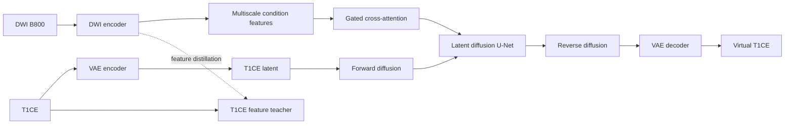

# Cross-Modal Breast MRI Synthesis

> **What if an MRI sequence could borrow the contrast knowledge of another modality?**

Contrast-enhanced T1-weighted MRI (T1CE) can make lesions and tissue boundaries easier to inspect, but it also adds contrast-agent exposure and acquisition overhead. Diffusion-weighted imaging at b=800 (DWI B800) captures different tissue behavior and is often available for the same anatomy.

This repository explores a promising connection between them: learn a generative prior for T1CE, then let DWI guide that prior toward a spatially aligned virtual contrast image.

**The T1CE branch learns what contrast should look like. The DWI branch learns where it should appear.**

## Why not treat this as ordinary image translation?

A direct image-to-image model has to solve two problems at once: learn the visual distribution of the target modality and discover which structures in the source modality should control it. When paired medical data is limited, those responsibilities compete for the same capacity.

The prototype separates them:

1. A variational autoencoder and an unconditional latent diffusion model learn the T1CE image space.
2. A DWI encoder extracts multiscale structural features from B800 images.
3. Gated cross-attention injects those features into the diffusion U-Net.
4. Cross-modal distillation encourages the DWI representation to approach features learned from T1CE.

The target-domain prior remains responsible for synthesis while the available modality supplies patient-specific structure.

## One target, three learning stages

### 1. Learn the target modality

A VAE compresses T1CE slices into a latent representation. An unconditional U-Net then learns to denoise that latent space, becoming a reusable T1CE generative prior.

### 2. Guide generation from DWI

A dedicated DWI encoder produces features at several resolutions. Gated cross-attention introduces those features into the denoising path without replacing the pretrained target prior. The repository includes both the original conditional path and a classifier-free-guidance variant.

### 3. Transfer cross-modal structure

An adapter projects DWI features toward the feature hierarchy produced by the T1CE encoder. The distillation objective complements diffusion noise prediction: one loss teaches the model to generate, while the other teaches the two modalities to speak a more compatible structural language.

## Architecture



## Repository map

| Path | Responsibility |
|---|---|
| `config.py` | Model, training, inference, and diagnostic configurations |
| `source/VAE/` | T1CE latent encoder/decoder and VAE training |
| `source/Unet/` | Unconditional latent diffusion prior |
| `source/cond_ldm/` | DWI encoder, gated conditioning, CFG training, inference, and diagnostics |
| `source/distill/` | Cross-modal feature distillation stage |
| `source/data_pre_processing/` | Registration, volume-to-slice conversion, paired dataset loading, and sampling |

## Data contract

No medical images, labels, patient records, pretrained weights, or checkpoints are distributed with this repository. Use only data that has been lawfully obtained, de-identified, and approved for the intended research.

The training code expects paired 2D slices under a local directory ignored by Git:

```text
data/raw_png/
├── b800/
│   └── case_001_b800/
│       ├── 0.png
│       └── 1.png
├── t1c/
│   └── case_001_t1c/
│       ├── 0.png
│       └── 1.png
├── segment/
│   └── case_001/
│       ├── 0.png
│       └── 1.png
├── train_list.txt
└── eval_list.txt
```

Each line in `train_list.txt` or `eval_list.txt` contains one case identifier such as `case_001`.

## Running the prototype

Create an environment with a PyTorch build suitable for your hardware, then install the remaining dependencies:

```bash
python -m venv .venv
source .venv/bin/activate
pip install -r requirements.txt
```

Training is organized around the three learning stages described above. Configuration lives in `config.py`.

```bash
# Stage 1: learn the T1CE latent space and diffusion prior
python -m source.VAE.train
python -m source.Unet.train

# Stage 2: train DWI-conditioned latent diffusion
python -m source.cond_ldm.train_cfg

# Stage 3: align DWI and T1CE feature hierarchies
python -m source.distill.train

# Generate virtual T1CE samples with classifier-free guidance
python -m source.cond_ldm.generate_b800_cfg
```

Checkpoints, generated images, logs, and datasets are excluded by `.gitignore`.

## Research scope

This code is a research prototype for studying cross-modal MRI synthesis. It does not include a trained model or a benchmark result, and it has not been clinically validated. Generated images must not be used for diagnosis or treatment decisions. The repository is not a medical device.

## A broader direction

Missing-modality synthesis is larger than one sequence pair. The same separation of responsibilities can be explored wherever one modality is common and another is informative but costly, slow, or inconsistently acquired:

- learn a strong prior in the target modality;
- preserve anatomy through an available source modality;
- align representations instead of asking one network to learn everything at once.

That framing turns virtual contrast from a single translation task into a reusable strategy for connecting complementary imaging protocols.

## License

Licensed under the [Apache License 2.0](./LICENSE). Copyright 2026 Hspikes.
