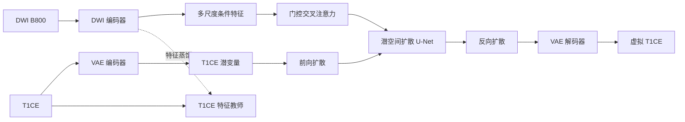

# 跨模态乳腺 MRI 合成

[English](./README.md) | [简体中文](./README.zh-CN.md)

> **能否以 DWI B800 为条件，生成与其空间对齐的 T1CE 图像？**

增强 T1 加权成像（T1CE）有助于显示病灶和组织边界，但需要使用造影剂并增加一组扫描序列。b=800 的弥散加权成像（DWI B800）反映组织的弥散特征，通常与 T1CE 覆盖相同的解剖区域。

本项目研究基于潜空间扩散模型的 DWI 条件 T1CE 合成。模型先从 T1CE 图像中学习此类图像的分布，再以 DWI 作为条件信号，生成与输入空间对齐的 T1CE 图像。

## 方法

直接使用端到端图像翻译模型时，模型需要同时学习 T1CE 图像分布以及从 DWI 到 T1CE 的映射。成对医学数据有限时，将 T1CE 生成先验和 DWI 条件编码分开，可以使训练目标更加明确。

具体实现包含四个部分：

1. 使用变分自编码器和无条件潜空间扩散模型学习 T1CE 图像空间；
2. 使用 DWI 编码器从 B800 图像中提取多尺度结构特征；
3. 通过门控交叉注意力将这些特征注入扩散 U-Net；
4. 通过跨模态蒸馏，让 DWI 表征逐步接近从 T1CE 中学到的特征。

扩散模型负责合成 T1CE，DWI 编码器提取的特征用于约束当前样本的生成结果。

## 训练流程

### 1. 训练 T1CE 生成先验

VAE 首先将 T1CE 切片压缩到潜空间。无条件 U-Net 在潜空间中学习噪声预测，得到 T1CE 生成先验。

### 2. 加入 DWI 条件

DWI 编码器在多个尺度上提取特征，门控交叉注意力将这些特征注入扩散 U-Net。仓库同时包含普通条件训练和无分类器引导（Classifier-Free Guidance，CFG）版本。

### 3. 对齐跨模态特征

适配器将 DWI 特征投影到 T1CE 编码器产生的特征层级。训练同时使用扩散噪声预测损失和特征蒸馏损失，分别约束图像生成和跨模态特征对齐。

## 架构



## 仓库结构

| 路径 | 职责 |
|---|---|
| `config.py` | 模型、训练、推理和诊断配置 |
| `source/VAE/` | T1CE 潜空间编码器、解码器和 VAE 训练 |
| `source/Unet/` | 无条件潜空间扩散先验 |
| `source/cond_ldm/` | DWI 编码器、门控条件注入、CFG 训练、推理与诊断 |
| `source/distill/` | 跨模态特征蒸馏阶段 |
| `source/data_pre_processing/` | 配准、三维体数据切片、成对数据加载和采样 |

## 数据约定

本仓库不提供医学影像、标注、病历信息、预训练权重或检查点。使用者应确保数据来源合法、已经完成脱敏，并已获准用于相应研究。

训练代码默认从 Git 忽略的本地目录读取成对二维切片：

```text
data/raw_png/
├── b800/
│   └── case_001_b800/
│       ├── 0.png
│       └── 1.png
├── t1c/
│   └── case_001_t1c/
│       ├── 0.png
│       └── 1.png
├── segment/
│   └── case_001/
│       ├── 0.png
│       └── 1.png
├── train_list.txt
└── eval_list.txt
```

`train_list.txt` 和 `eval_list.txt` 每行保存一个样本编号，例如 `case_001`。

## 运行原型

先创建虚拟环境并安装依赖。如需 CUDA，请先根据硬件选择合适的 PyTorch 构建，再执行下面的安装命令。

```bash
python -m venv .venv
source .venv/bin/activate
pip install -r requirements.txt
```

训练按照上述三个阶段进行，所有配置集中在 `config.py`。

```bash
# 阶段一：学习 T1CE 潜空间与扩散先验
python -m source.VAE.train
python -m source.Unet.train

# 阶段二：训练由 DWI 引导的条件潜空间扩散模型
python -m source.cond_ldm.train_cfg

# 阶段三：对齐 DWI 与 T1CE 的特征层级
python -m source.distill.train

# 使用无分类器引导生成虚拟 T1CE
python -m source.cond_ldm.generate_b800_cfg
```

检查点、生成图像、日志和数据集均由 `.gitignore` 排除。

## 许可证

本项目使用 [Apache License 2.0](./LICENSE)。版权所有 © 2026 Hspikes。
