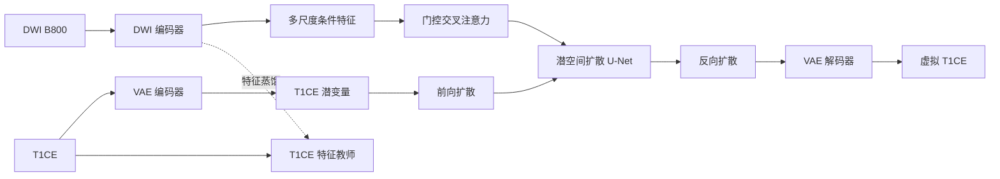

# 跨模态乳腺 MRI 合成

[English](./README.md) | [简体中文](./README.zh-CN.md)

> **能否让一种 MRI 序列借助另一种模态，重建原本缺失的增强信息？**

增强 T1 加权成像（T1CE）能够更清楚地呈现病灶和组织边界，但也意味着造影剂使用以及额外的扫描时间与流程负担。b=800 的弥散加权成像（DWI B800）刻画的是另一类组织特征，却往往与 T1CE 覆盖同一解剖区域。

这个项目沿着一条更有潜力的思路展开：先从 T1CE 中学习生成先验，再让 DWI 根据当前样本的结构，引导这个先验合成空间对齐的虚拟增强图像。

**T1CE 分支负责学会“增强图像应该长什么样”，DWI 分支负责提供“增强信号应该出现在哪里”的结构线索。**

## 为什么不把它当作普通的图像翻译？

直接使用图像到图像模型，需要同时解决两个问题：既要学会目标模态的视觉分布，又要找出源模态中哪些结构应当控制生成结果。当成对医学数据有限时，这两项责任会争夺同一套模型容量。

这个原型把它们拆开处理：

1. 使用变分自编码器和无条件潜空间扩散模型学习 T1CE 图像空间；
2. 使用 DWI 编码器从 B800 图像中提取多尺度结构特征；
3. 通过门控交叉注意力将这些特征注入扩散 U-Net；
4. 通过跨模态蒸馏，让 DWI 表征逐步接近从 T1CE 中学到的特征。

这样，目标模态先验专注于生成，可用模态只负责提供与当前样本相关的结构约束。

## 一个目标，三个学习阶段

### 1. 学会目标模态

VAE 首先把 T1CE 切片压缩到潜空间。无条件 U-Net 随后学习如何在这个潜空间中去噪，形成可以复用的 T1CE 生成先验。

### 2. 让 DWI 引导生成

独立的 DWI 编码器在多个尺度上提取特征。门控交叉注意力把这些特征引入去噪过程，同时保留预训练目标先验的主体职责。仓库同时包含原始条件生成路径和无分类器引导（Classifier-Free Guidance，CFG）版本。

### 3. 传递跨模态结构

适配器将 DWI 特征投影到 T1CE 编码器产生的特征层级。蒸馏目标与扩散噪声预测相互补充：一个损失教模型如何生成，另一个损失让两种模态在结构表征上使用更接近的语言。

## 架构



## 仓库结构

| 路径 | 职责 |
|---|---|
| `config.py` | 模型、训练、推理和诊断配置 |
| `source/VAE/` | T1CE 潜空间编码器、解码器和 VAE 训练 |
| `source/Unet/` | 无条件潜空间扩散先验 |
| `source/cond_ldm/` | DWI 编码器、门控条件注入、CFG 训练、推理与诊断 |
| `source/distill/` | 跨模态特征蒸馏阶段 |
| `source/data_pre_processing/` | 配准、三维体数据切片、成对数据加载和采样 |

## 数据约定

本仓库不提供医学影像、标注、病历信息、预训练权重或检查点。使用者应确保数据来源合法、已经完成脱敏，并已获准用于相应研究。

训练代码默认从 Git 忽略的本地目录读取成对二维切片：

```text
data/raw_png/
├── b800/
│   └── case_001_b800/
│       ├── 0.png
│       └── 1.png
├── t1c/
│   └── case_001_t1c/
│       ├── 0.png
│       └── 1.png
├── segment/
│   └── case_001/
│       ├── 0.png
│       └── 1.png
├── train_list.txt
└── eval_list.txt
```

`train_list.txt` 和 `eval_list.txt` 每行保存一个样本编号，例如 `case_001`。

## 运行原型

先创建虚拟环境并安装依赖。如需 CUDA，请先根据硬件选择合适的 PyTorch 构建，再执行下面的安装命令。

```bash
python -m venv .venv
source .venv/bin/activate
pip install -r requirements.txt
```

训练流程对应上面的三个学习阶段，所有配置集中在 `config.py`。

```bash
# 阶段一：学习 T1CE 潜空间与扩散先验
python -m source.VAE.train
python -m source.Unet.train

# 阶段二：训练由 DWI 引导的条件潜空间扩散模型
python -m source.cond_ldm.train_cfg

# 阶段三：对齐 DWI 与 T1CE 的特征层级
python -m source.distill.train

# 使用无分类器引导生成虚拟 T1CE
python -m source.cond_ldm.generate_b800_cfg
```

检查点、生成图像、日志和数据集均由 `.gitignore` 排除。

## 许可证

本项目使用 [Apache License 2.0](./LICENSE)。版权所有 © 2026 Hspikes。
